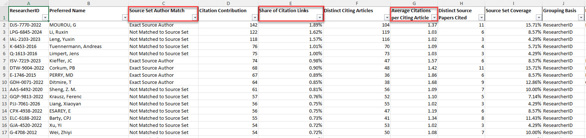

# Web of Science Citing Author Analysis

A Python workflow for analyzing authors associated with a Web of Science source set and the authors of papers that cite that set.

The analysis uses **citation-link-weighted counts**. If one citing article cites five different papers in the source set, each author on that citing article receives five Citation Contributions from that article. This preserves the full source-paper → citing-paper citation relationship instead of reducing the analysis to a simple count of distinct citing articles.

The script uses the **Web of Science Expanded API** with **Short Record (`optionView=SR`) retrieval for both source records and citing records**. It is designed to work with the companion robust clients `wosesrclient_robust.py` and `wosecitingclient_robust.py`.

## What the script does

The workflow runs in six stages:

1. **Retrieve source records using Short Record**
2. **Analyze authors on the source records**
3. **Retrieve citing articles as Short Records** for each source record
4. **Consolidate unique citing Short Records locally**
5. **Analyze citation contribution by citing author**
6. **Write the Excel output**

Citing records are cached as they are returned by the `/citing` endpoint. This avoids a second API pass to retrieve author metadata while preserving every source-paper → citing-paper citation link.

Progress is printed during long retrieval stages so that large citation sets do not appear to stall.

## Example Output

Below is an example of the Citing Author Analysis output:

<p align="center">
  
</p>

## Why citation-link weighting matters

Suppose a source set contains Papers A, B, and C, and one citing paper cites all three.

That citing paper represents:

- **3 Citation Contributions**
- **1 Distinct Citing Article**
- **3 Distinct Source Papers Cited**
- **3.00 Average Citations per Citing Article**

This distinguishes an author who appears on many papers that each cite the source set once from an author whose citing papers repeatedly reference multiple items in the source set.

## Repository files

| File | Purpose |
| --- | --- |
| `wose_citing_author_analysis.py` | Main analysis script |
| `wosesrclient_robust.py` | Required robust Web of Science Short Record client |
| `wosecitingclient_robust.py` | Required robust Web of Science citing-endpoint client |
| `requirements.txt` | Python dependencies |
| `.env.example` | Example API-key configuration |
| `.gitignore` | Excludes local environments, API keys, caches, and generated output |
| `LICENSE` | MIT License |

The two robust client files must be in the same directory as the analysis script, or otherwise available on the Python path.

The citing client must expose:

- `get_response(...)`
- `WoSAuthenticationError`

and must pass supplied request parameters through to the `/api/wos/citing` endpoint so that `optionView=SR` is honored.

## Requirements

- Python 3.10 or later recommended
- Access to the Web of Science Expanded API
- A valid Expanded API key

Install the Python dependencies with:

```bash
pip install -r requirements.txt
```

Dependencies:

- `requests`
- `python-dotenv`
- `pandas`
- `xlsxwriter`
- `openpyxl`

The script prefers `xlsxwriter` for Excel formatting and falls back to `openpyxl` if necessary.

## Setup

### 1. Place the scripts together

Your working directory should contain at least:

```text
wose_citing_author_analysis.py
wosesrclient_robust.py
wosecitingclient_robust.py
requirements.txt
.env
```

### 2. Create a virtual environment

Windows:

```bash
python -m venv .venv
.venv\Scripts\activate
```

macOS/Linux:

```bash
python3 -m venv .venv
source .venv/bin/activate
```

Then install the dependencies:

```bash
pip install -r requirements.txt
```

### 3. Configure the API key

Copy `.env.example` to `.env` and add your Web of Science Expanded API key:

```text
EXPANDED_APIKEY=your_api_key_here
```

The `.env` file is excluded by `.gitignore` and should not be committed to GitHub.

You can also supply the key directly with `-k` / `--key`.

## Usage

The script supports two ways to supply the Web of Science query.

### Option 1: Edit the query directly in the script

Near the top of `wose_citing_author_analysis.py`, edit the `params` block:

```python
params = {
    "databaseId": "WOS",
    "usrQuery": "AU=(Stanwood)",
    "firstRecord": 1,
    "count": 50,
    "optionView": "SR",
}
```

Then run:

```bash
python wose_citing_author_analysis.py
```

This is often the simplest option for users who prefer editing visible settings in the script rather than supplying command-line arguments.

### Option 2: Supply a query on the command line

```bash
python wose_citing_author_analysis.py -q "AU=(LastName Initials)"
```

When `-q` / `--query` is supplied, it overrides `params["usrQuery"]` for that run.

Any valid Web of Science query can be used to define the source set.

### Specify an output filename

Using the hardcoded query:

```bash
python wose_citing_author_analysis.py -o citing_author_analysis.xlsx
```

Or with a command-line query override:

```bash
python wose_citing_author_analysis.py -q "AU=(LastName Initials)" -o citing_author_analysis.xlsx
```

If `-o` is omitted, the script creates a filename in the form:

```text
WOS_CitingAuthorAnalysis_<query>_<YYYYMMDD_HHMM>.xlsx
```

### Supply the API key on the command line

```bash
python wose_citing_author_analysis.py -k YOUR_API_KEY
```

This can also be combined with `-q` when you want to override the hardcoded query.

Using `.env` is generally preferable so the key does not appear in command history.

### Exclude authors without a ResearcherID

```bash
python wose_citing_author_analysis.py --exclude-authors-without-rid
```

This can also be combined with `-q` when you want to override the hardcoded query.

By default, authors without a Web of Science ResearcherID are retained using a normalized-name fallback grouping key.

## Retrieval architecture

### Source records

The source query is retrieved through the Expanded API using:

```text
optionView=SR
```

### Citing records

For each source UID, the script calls the Expanded API `/citing` endpoint with:

```text
optionView=SR
```

Each source-paper → citing-paper relationship is retained as a citation link.

At the same time, each unique citing Short Record is cached once. If the same citing article cites several source papers, the citation relationships are all preserved while the citing record itself is stored only once.

For example:

```text
Source A → Citing X
Source B → Citing X
Source C → Citing Y
```

The analysis retains three citation links but only two unique citing Short Records. Authors on Citing X receive a Citation Contribution of 2.

No second Short Record retrieval pass is required.

## Author identification

Authors are grouped primarily by Web of Science **ResearcherID (`r_id`)**.

The preferred display label is `preferred_name.full_name`, with fallbacks to other Short Record author-name fields when necessary.

If an author does not have a ResearcherID, the default behavior retains the author using a normalized-name fallback. This behavior can be disabled with `--exclude-authors-without-rid`.

### Source-set author matching

Citing authors are compared with authors who appear in the original source set:

- **Exact Source Author** — the same ResearcherID appears in the source set.
- **Possible Source Author** — the ResearcherID differs or is absent, but a normalized author name matches a source-set author name.
- **Not Matched to Source Set** — neither condition is met.

Possible name matches are diagnostic only. They do **not** merge author identities. The `Matched Source ResearcherID(s)` field is placed at the end of the Citing Author Analysis sheet for inspection when needed.

## Output workbook

The script creates one Excel workbook with four sheets.

### Source Author Analysis

Summarizes authors appearing on the original source records.

| Column | Meaning |
| --- | --- |
| `ResearcherID` | Web of Science ResearcherID when available |
| `Preferred Name` | Preferred author display name |
| `Paper Count` | Number of source papers on which the author appears |
| `Percent of Source Papers` | Share of source records containing the author |
| `Grouping Basis` | `ResearcherID` or `Name fallback` |

### Citing Author Analysis

The primary analysis sheet, ranked by Citation Contribution.

| Column | Meaning |
| --- | --- |
| `ResearcherID` | Web of Science ResearcherID when available |
| `Preferred Name` | Preferred author display name |
| `Source Set Author Match` | Exact, possible, or no source-author match |
| `Citation Contribution` | Number of source-paper → citing-paper citation links associated with the author |
| `Share of Citation Links` | Author Citation Contribution divided by all citation links in the analysis |
| `Distinct Citing Articles` | Number of unique citing papers on which the author appears |
| `Average Citations per Citing Article` | Citation Contribution divided by Distinct Citing Articles |
| `Distinct Source Papers Cited` | Number of unique source-set papers reached by the author's citing articles |
| `Source Set Coverage` | Distinct Source Papers Cited divided by the total number of source records |
| `Grouping Basis` | `ResearcherID` or `Name fallback` |
| `Matched Source ResearcherID(s)` | ResearcherID(s) supporting a source-set match; primarily diagnostic |

### Citing UT Summary

Provides article-level context for the citing set.

| Column | Meaning |
| --- | --- |
| `Citing UID` | Web of Science UID of the citing article |
| `Citation Link Count` | Number of source-paper → citing-paper links for that citing article |
| `Distinct Source Papers Cited` | Number of distinct source-set papers cited |
| `Source UIDs Cited` | Space-separated source UIDs cited by the article |

### Search Summary

Records the query, run timing, source/citing counts, Short Record retrieval mode, author-match counts, metric definitions, missing metadata, and any citing-endpoint retrieval errors.

## Metric interpretation

### Citation Contribution

This is the primary ranking metric.

Each source-paper → citing-paper relationship counts once. If one citing article cites five source-set papers, every author on that citing article receives a Citation Contribution of five from that article.

### Share of Citation Links

```text
Citation Contribution / Total Citation Links
```

This measures the author's share of all source-paper → citing-paper relationships in the analysis.

### Average Citations per Citing Article

```text
Citation Contribution / Distinct Citing Articles
```

This measures the average number of source-set citation links associated with each citing article on which the author appears.

### Source Set Coverage

```text
Distinct Source Papers Cited / Total Source Records
```

This measures how broadly an author's citing articles reach across the original source set.

## Interpretation and responsible use

The metrics produced by this script are **descriptive bibliometric indicators**. Citation concentration, source-author overlap, repeated collaboration, or high citation contribution can arise for many legitimate reasons, including specialized research communities, long-term collaborations, review articles, methods papers, and closely related research programs.

The output should therefore be treated as a way to identify patterns for further investigation, **not as evidence of inappropriate citation behavior or research misconduct on its own**.

When using the workflow for research-integrity or due-diligence purposes, review the underlying publications and citation context before drawing conclusions.

## Notes

- Citing records are retrieved separately for each source UID so every source-paper → citing-paper relationship is preserved.
- Citing records are requested directly as Short Records using `optionView=SR`.
- Unique citing Short Records are cached during citing retrieval; there is no second citing-metadata API pass.
- Progress is printed by stage, source record, and citing page during long runs.
- API retry, throttling, authentication handling, and pagination are provided by the companion robust clients.
- The script does not export a separate raw Citation Links file; citation links are retained internally for the analysis.

## License

This project is released under the MIT License. See [`LICENSE`](LICENSE).

## Web of Science

This project requires authorized access to the Web of Science Expanded API. Web of Science is a product of Clarivate. Users are responsible for complying with the terms governing their API access and use of Web of Science data.
